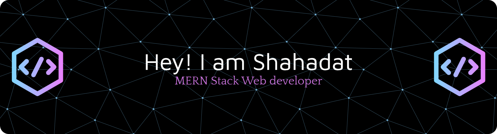

<!-- =====================================================
      GitHub Profile README
      Author: Shahadat Hasan
===================================================== -->

<div align="center">



<br/>


<br/>


</div>

<br/>

<!-- ===================== ABOUT ===================== -->
# 👨‍💻 About Me


Hello 👋 I'm **Shahadat Hasan**

I am a passionate **Full Stack Developer** from Bangladesh 🇧🇩.

I specialize in building modern, responsive, and scalable web applications using JavaScript technologies.

### 🚀 My Focus
- ⚛️ React.js Development
- ▲ Next.js Applications
- 🟦 TypeScript Development
- 🔥 Backend API Development
- 🗄 Database Design
- 🔐 Secure Authentication
- ⚡ Performance Optimization

### ⚡ Fun Facts
- 🌱 Currently mastering **System Design** & **PostgreSQL**
- 💬 Ask me about **React, Next.js, Node.js, MongoDB**
- 📫 Reach me via LinkedIn or Email
- 🎯 2026 Goal: Ship production-grade full-stack products

<br clear="right"/>

---

<!-- ===================== DEV PROFILE ===================== -->
# 🧑‍💻 Developer Profile

```javascript
const shahadat = {
  name: "Shahadat Hasan",
  role: "Full Stack Developer",

  skills: {
    frontend: ["React.js", "Next.js", "TypeScript", "Tailwind CSS"],
    backend:  ["Node.js", "Express.js", "REST API"],
    database: ["MongoDB", "PostgreSQL", "Prisma"]
  },

  currentlyWorkingOn: "Scalable full-stack products",
  currentlyLearning: ["System Design", "Docker", "CI/CD"],

  goal: "Create scalable production-ready software"
}
```

---

<!-- ===================== TECH STACK ===================== -->
# 🛠️ Technology Stack

## Frontend
<p></p>

## Backend
<p></p>

## Database
<p></p>

## Tools
<p></p>

---

<!-- ===================== PROJECTS ===================== -->
# 🚀 Featured Projects

<table>
<tr>
<td width="50%">

### 🏥 Medicare
Healthcare medicine platform

**Features**
- User Authentication
- Medicine Management
- Product Search
- Secure API
- Responsive Design

**Built With**
`React.js` `Node.js` `Express.js` `MongoDB` `Firebase`

🔗 [Live Demo](https://medicine-app-store.web.app/)

</td>
<td width="50%">

### 🌐 Portfolio Website
Developer portfolio website

**Features**
- Modern UI
- Responsive Layout
- Project Showcase
- Contact System

**Built With**
`React.js` `JavaScript` `Tailwind CSS`

🔗 [Live Demo](https://my-portfolio-app-29430.web.app/)

</td>
</tr>
</table>


---

<!-- ===================== LEARNING ===================== -->
# 📚 Currently Learning

```yaml
Learning:
  - System Design
  - Advanced TypeScript
  - Prisma ORM
  - PostgreSQL
  - Docker
  - CI/CD

Improving:
  - Backend Architecture
  - Cloud Deployment
  - Software Engineering
```

---

<!-- ===================== STATS ===================== -->
# 📊 GitHub Statistics

<div align="center">


</div>

<br/>

<div align="center">

</div>

<br/>

<div align="center">

### 📈 Activity Graph


</div>

---

<!-- ===================== TROPHY ===================== -->
# 🏆 GitHub Trophy

<div align="center">

</div>

---

<!-- ===================== SNAKE ===================== -->
<p align="center">
  <picture>
    <source media="(prefers-color-scheme: dark)" srcset="https://raw.githubusercontent.com/ShahadatHasan623/ShahadatHasan623/output/github-snake-dark.svg" />
    <source media="(prefers-color-scheme: light)" srcset="https://raw.githubusercontent.com/ShahadatHasan623/ShahadatHasan623/output/github-snake.svg" />
    
  </picture>
</p>

---

<!-- ===================== CAREER ===================== -->
# 💼 Career Status

```json
{
  "availability": "Open for Work",
  "role": "Full Stack Developer",
  "location": "Bangladesh",

  "stack": [
    "React.js",
    "Next.js",
    "TypeScript",
    "Node.js",
    "PostgreSQL"
  ],

  "work": [
    "Remote",
    "Full Time",
    "Freelance"
  ]
}
```

---

<!-- ===================== RESUME ===================== -->
# 📄 Resume

<div align="center">

[](https://drive.google.com/file/d/11Ckl2rwVKpYqwCxrkiewXGJcBx1uK9NN/view)

</div>

---

<!-- ===================== SUPPORT ===================== -->
# ☕ Support Me

<div align="center">

If you like my work, consider buying me a coffee — it keeps the code (and the caffeine) flowing!

<a href="https://www.buymeacoffee.com/" target="_blank">

</a>

</div>

---

<!-- ===================== CONNECT ===================== -->
# 🤝 Connect With Me

<div align="center">

<a href="https://linkedin.com/in/md-shahadat-942577305">

</a>
<a href="https://github.com/shahadathasan623">

</a>
<a href="https://instagram.com/shahadat9790">

</a>
<a href="https://facebook.com/shahadat.shariar.2024">

</a>

</div>

---

<div align="center">

## ⭐ Thanks For Visiting My Profile

### 🚀 Let's Build Something Amazing Together

</div>
